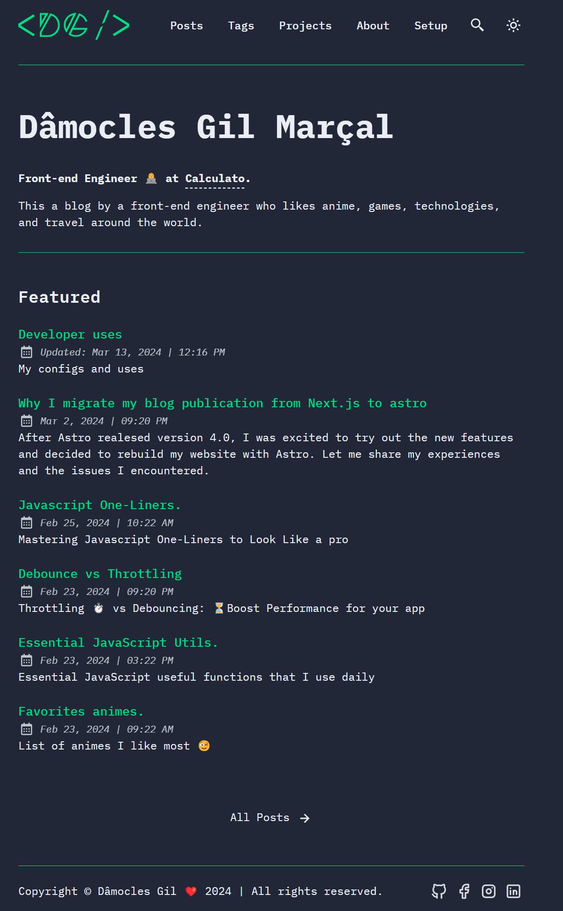

	<h1>damoclesgil.com.br</h1>
	
My personal website using Astro.js. 😊

	
	
	

 

## 💻 Tech Stack

**Main Framework** - [Astro](https://astro.build/)  
**Type Checking** - [TypeScript](https://www.typescriptlang.org/)  
**Component Framework** - [ReactJS](https://reactjs.org/)  
**Styling** - [TailwindCSS](https://tailwindcss.com/)  
**UI/UX** - [Figma](https://figma.com)  
**Fuzzy Search** - [FuseJS](https://fusejs.io/)  
**Icons** - [Boxicons](https://boxicons.com/) | [Tablers](https://tabler-icons.io/)  
**Code Formatting** - [Prettier](https://prettier.io/)  
**Deployment** - [Cloudflare Pages](https://pages.cloudflare.com/)  
**Illustration in About Page** - [https://freesvgillustration.com](https://freesvgillustration.com/)  
**Linting** - [ESLint](https://eslint.org)

## 🧞 Commands

All commands are run from the root of the project, from a terminal:

> **_Note!_** For `Docker` commands we must have it [installed](https://docs.docker.com/engine/install/) in your machine.

| Command                              | Action                                                                                                                           |
| :----------------------------------- | :------------------------------------------------------------------------------------------------------------------------------- |
| `npm install`                        | Installs dependencies                                                                                                            |
| `npm run dev`                        | Starts local dev server at `localhost:4321`                                                                                      |
| `npm run build`                      | Build your production site to `./dist/`                                                                                          |
| `npm run preview`                    | Preview your build locally, before deploying                                                                                     |
| `npm run format:check`               | Check code format with Prettier                                                                                                  |
| `npm run format`                     | Format codes with Prettier                                                                                                       |
| `npm run sync`                       | Generates TypeScript types for all Astro modules. [Learn more](https://docs.astro.build/en/reference/cli-reference/#astro-sync). |
| `npm run cz`                         | Commit code changes with commitizen                                                                                              |
| `npm run lint`                       | Lint with ESLint                                                                                                                 |
| `docker compose up -d`               | Run AstroPaper on docker, You can access with the same hostname and port informed on `dev` command.                              |
| `docker compose run app npm install` | You can run any command above into the docker container.                                                                         |
| `pnpm add -g pnpm`                   | Update PNPM Version                                                                                                              |

---

## 📋 Todo

- [] Post with my boilerplates using next, vue and astro.
- [] Convert pngs imgs to jpgs
- [] CV File Download Option.

Made with 💚 by [Dâmocles Gil Marçal](https://damoclesgil.com.br) 👨🏻‍💻
